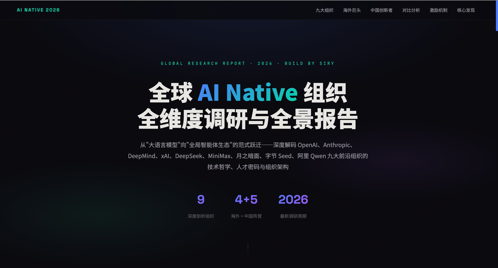

<div align="center">



<br/>
<br/>

# 2026 全球 AI Native 组织全维度调研与全景报告

**从"大语言模型"向"全局智能体生态"的范式跃迁**

深度解码 OpenAI、Anthropic、DeepMind、xAI、DeepSeek、MiniMax、月之暗面、字节 Seed、阿里 Qwen 九大前沿组织的技术哲学、人才密码与组织架构

[](https://creativecommons.org/licenses/by-nc/4.0/)


[🔗 在线预览](https://你的用户名.github.io/ai-native-report/) · [📄 查看报告](./index.html)

</div>

---

## 📌 项目简介

本项目将《2026 全球 AI Native 组织全维度调研与未来组织建设全景报告》转化为**交互式单页网页应用**，以可视化、结构化的方式呈现报告全部内容，便于阅读、理解与分享。

> 在 2025—2026 年的技术演进周期中，全球人工智能的发展正式跨越基础模型阶段，全面迈入 **"Agentic 组织重构"** 的新纪元。本报告全维度剖析全球最顶尖的 AI 实验室与企业，揭示 AI Native 组织的底层运作逻辑。

## 🏢 涵盖组织

| 阵营 | 组织 |
|:---:|------|
| 🌎 海外 | OpenAI · Anthropic · Google DeepMind · xAI |
| 🌏 中国 | DeepSeek · MiniMax · 月之暗面 Moonshot AI · 字节跳动 Seed · 阿里通义千问 |

## 📊 报告结构

```
├── Part 01  九家组织全景总览（数据表 + 团队规模可视化）
├── Part 02  海外前沿 AI 巨头（OpenAI / Anthropic / DeepMind / xAI）
├── Part 03  中国 AI Native 创新者（DeepSeek / MiniMax / Moonshot / Seed / Qwen）
├── Part 04  跨组织对比与深度解构（组织矩阵 · 东西方差异 · 薪酬可视化）
├── Part 05  全球激励机制深度拆解（PPU · 算力货币 · 月度期权 · 合伙人制）
└── Part 06  三大核心发现（选拔机制 · 激励逻辑 · 人机交互范式）
```

## 💡 核心发现

- **创新密度 > 组织规模** — DeepSeek 以 150 人挑战 3000+ 人的 OpenAI，Moonshot 以 1% 算力交付万亿参数模型
- **算力即权力（Compute as Currency）** — GPU 算力配额已超越薪水成为顶级科学家的核心激励
- **从"人在回路"到"人在其上"** — MiniMax 90% 员工配备 Agent Intern，人类角色重塑为宏观流程架构师

## 🛠 技术实现

- **纯静态单文件** — 单个 `index.html`，零依赖，零构建
- **原生技术栈** — HTML5 + CSS3 + Vanilla JavaScript
- **响应式设计** — 桌面端与移动端自适应
- **交互功能** — 可展开卡片、标签页切换、动态条形图、滚动渐入动画

## 🚀 快速开始

**方式一：直接打开**

下载后双击 `index.html` 即可在浏览器中查看。

**方式二：GitHub Pages 部署**

1. Fork 本仓库
2. 进入 Settings → Pages
3. Source 选择 `main` 分支，目录选 `/ (root)`
4. 保存后访问 `https://你的用户名.github.io/ai-native-report/`

**方式三：本地服务**

```bash
# 使用 Python
python -m http.server 8080

# 使用 Node.js
npx serve .
```

## 📁 项目结构

```
ai-native-report/
├── index.html    # 交互式报告主文件
├── cover.png     # 封面截图
├── LICENSE       # 许可证
└── README.md     # 本文件
```

## 📝 数据说明

- 所有内容基于 2026 年初公开信息与调研数据
- 薪酬数据因各组织统计口径不同（基本薪资 vs 全包），仅供参考
- 部分数据为估算值，已在报告中标注

## 📜 License

本项目采用 [CC BY-NC 4.0](https://creativecommons.org/licenses/by-nc/4.0/) 许可协议。

你可以自由分享和改编本作品，但须注明出处，且不得用于商业用途。

---

<div align="center">

**Build By Siry**

⭐ 如果觉得有用，欢迎 Star

</div>
